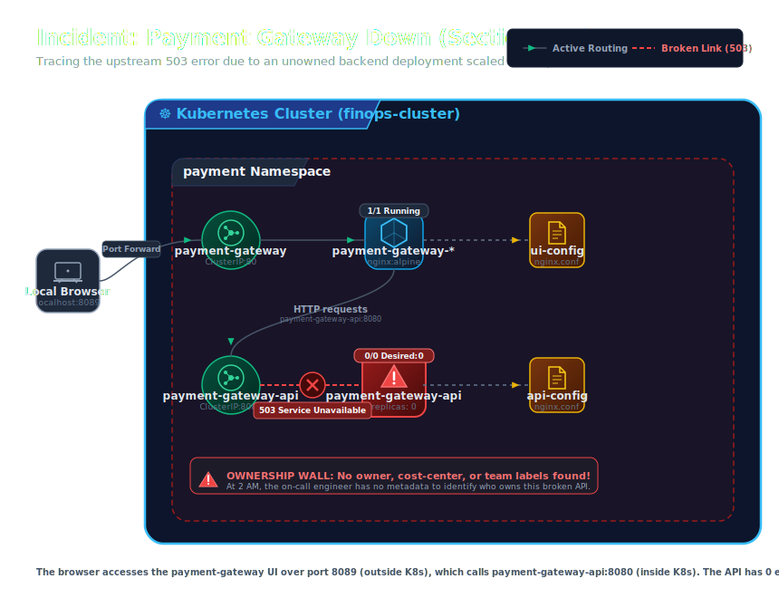

# Section 02a Guide: Payment Gateway Down

This is the only file you need for Section 02a.

## Incident Architecture

During this live incident simulation, the flow of traffic from the client browser through to the backend API, and the point of failure, is mapped out below. This illustrates the visual system architecture and highlights where the upstream 503 error occurs due to the missing API pods:



## Goal
Experience the real-world pain of debugging a down payment service with no ownership metadata.

## Tutor note
This section is a live incident simulation. Run it dramatically. Let students struggle
at the "who do we call?" step before revealing the answer: there is no answer, because
the labels are missing.

## What students will learn
- what a real Kubernetes incident looks like from the console
- how to trace a failing endpoint through services, deployments, and pods
- why missing labels mean no owner, no Slack channel, no on-call team
- the difference between a quick dirty fix and a real governance solution

## Prerequisites
**Complete Section 01 and Section 02 fully before starting this section.**

Confirm this before proceeding:
```bash
kubectl get pods -n payment
```
You should see `payment-processor` running from Section 02.

---

## Step 1: Deploy the payment gateway

Apply both new resources (the UI and the broken API) in one command:

```bash
kubectl apply -k sections/02a-payment-gateway-down/manifests/
```

Expected output:
```
configmap/payment-gateway-ui-config created
deployment.apps/payment-gateway created
service/payment-gateway created
configmap/payment-gateway-api-config created
deployment.apps/payment-gateway-api created
service/payment-gateway-api created
```

## Step 2: Check what is running

```bash
kubectl get all -n payment
```

What to notice:
- `payment-processor` is running (from Section 02)
- `payment-gateway` pod is `Running` — this is the UI
- `payment-gateway-api` has **0/0** pods — no pod is running

```bash
kubectl get pods -n payment
```

There is no pod for `payment-gateway-api` at all. That is the problem. (`kubectl get deployments -n payment` would show `payment-gateway-api` as `0/0`.)

## Step 3: Open the payment UI in Chrome

Port-forward the UI service to your local machine:

```bash
kubectl port-forward svc/payment-gateway -n payment 8089:80
```

Keep this terminal open. Open Chrome and go to:

```
http://localhost:8089
```

You will see the **AirPay** payment gateway — a Stripe-like interface with a card form.

**Point out to students:**
- The status indicator at the bottom left says **"Payment API: Down"**
- An incident alert banner appears at the top automatically
- These are detected by the UI itself via a health check call to the backend

## Step 4: Try to make a payment

Fill in any dummy card details and click **"Pay Securely — $499.00"**.

What happens:
- The button shows a spinner for a few seconds
- A red error banner appears: **"Payment Failed — Service Unreachable"**
- The error trace shows: `503 Service Unavailable → upstream: payment-gateway-api:8080`

This is the incident. The payment service is down. Let's debug it.

---

## Debug flow: finding the root cause

### Step 5: Check the services in the payment namespace

```bash
kubectl get services -n payment
```

Both services exist. The Kubernetes service object is there — so it's not a service
configuration problem. Something is wrong with the backend pods.

### Step 6: Check the pods

```bash
kubectl get pods -n payment
```

Expected output:
```
NAME                                READY   STATUS    RESTARTS   AGE
payment-processor-xxx               1/1     Running   0          Xm
payment-gateway-xxx                 1/1     Running   0          Xm
```

Notice: there is **no pod** for `payment-gateway-api`. Zero pods.

### Step 7: Inspect the deployment

```bash
kubectl describe deployment payment-gateway-api -n payment
```

What to look for:
- `Replicas: 0 desired | 0 updated | 0 available`
- No events about scheduling or image errors
- The deployment is valid — it just has zero replicas set

```bash
kubectl get deployment payment-gateway-api -n payment -o yaml | grep -A3 'replicas:'
```

This confirms: `replicas: 0` — someone scaled it to zero, or it was deployed that way.

### Step 8: Try to get logs

```bash
kubectl logs -n payment deploy/payment-gateway-api
```

Expected:
```
Error from server (BadRequest): no containers found in running state in pod ...
```
or
```
Error: no pod found for deployment payment-gateway-api
```

No pods = no logs = no clues from inside the container.

### Step 9: Check the service endpoints

```bash
kubectl get endpoints payment-gateway-api -n payment
```

Expected output:
```
NAME                  ENDPOINTS   AGE
payment-gateway-api   <none>      Xm
```

`<none>` — the service has no healthy pods to route traffic to. This is why the UI gets
a 503. The service exists, the DNS resolves, but there is nothing on the other end.

---

## The ownership wall — who do we call?

### Step 10: Look for ownership labels

```bash
kubectl get deployment payment-gateway-api -n payment -o yaml
```

Scroll to the `labels:` section under `metadata`. What do you see?

```yaml
labels:
  app: payment-gateway-api
```

That is it. One label. No `owner`. No `team`. No `cost-center`. No `tier`.
No `environment`. No Slack channel. No on-call rotation. Nothing.

### Step 11: Scan all payment-namespace deployments for ownership info

```bash
kubectl get deployments -n payment --show-labels
```

Look at the LABELS column for every deployment. None of them have a clear owner tag.

### Step 12: Search the whole cluster

```bash
kubectl get deployments -A --show-labels | grep payment
```

Even across all namespaces — you cannot tell which team owns the payment gateway API.

**Pause here and ask the class:**
> "It's 2 AM. This is paging you. The payment service is down. Customers cannot complete
> purchases. Which team do you call? Which Slack channel do you post to?
> Who is the on-call engineer for this service?"
>
> Answer: **You don't know. There is no way to find out from the cluster metadata.**
>
> This is the exact situation DevOps and platform teams deal with every day at scale.
> In a cluster with 50+ services across 10+ teams, a missing `owner` label means
> 30 minutes wasted just figuring out who to wake up.

---

## The bad fix — and why it is not the answer

### Step 13: Scale the deployment back up

```bash
kubectl scale deployment payment-gateway-api -n payment --replicas=1
```

Wait for the pod to start:

```bash
kubectl get pods -n payment -w
```

Press Ctrl+C once the pod is `Running`.

### Step 14: Add ownership labels manually

```bash
kubectl label deployment payment-gateway-api -n payment \
  owner=payments-team \
  cost-center=cc-payments \
  tier=backend \
  environment=prod \
  --overwrite
```

Confirm the labels are there:

```bash
kubectl get deployment payment-gateway-api -n payment --show-labels
```

### Step 15: Refresh Chrome and test the payment

Go back to `http://localhost:8089` and refresh the page.

What you should see:
- The incident banner is gone
- The status indicator shows **"Payment API: Operational"** (green dot)
- Click "Pay Securely" → payment succeeds with a transaction ID

---

## Why this fix is wrong

> ⚠️ **This is not the right approach — it only looks like a fix.**

Here is why manually applying labels is a band-aid, not a solution:

1. **Not in version control.** The label only exists in the live cluster. The next
   `kubectl apply` or Helm upgrade from the CI pipeline will overwrite it and the label
   will be gone again.

2. **It does not prevent recurrence.** The next engineer who deploys a new service will
   make the same mistake because there is no enforcement.

3. **It does not scale.** In a cluster with 200 services, you cannot manually audit and
   patch labels one by one. You need a policy engine.

4. **Scaling replicas from the command line is drift.** The deployment manifest says
   `replicas: 0`. The cluster now has `replicas: 1`. These are out of sync. GitOps will
   reconcile this back to 0 at the next sync.

**The real fix is governance** — enforcing a required label policy at admission time,
tracking compliance automatically, and flagging violations before they become incidents.
That is what the rest of this course builds.

---

## Cleanup

When you are done demonstrating, stop the port-forward with Ctrl+C in that terminal.

To reset the API back to the broken state for a re-demo:
```bash
kubectl scale deployment payment-gateway-api -n payment --replicas=0
```

---

## Handoff to Section 03

Move to:
- `sections/03-finops-problems/guide.md`

Section 03 takes a systematic look at every workload in the cluster — not just the
payment service — and shows exactly how widespread the missing-label problem is.
The incident you just debugged is only one symptom of a cluster-wide governance gap.
