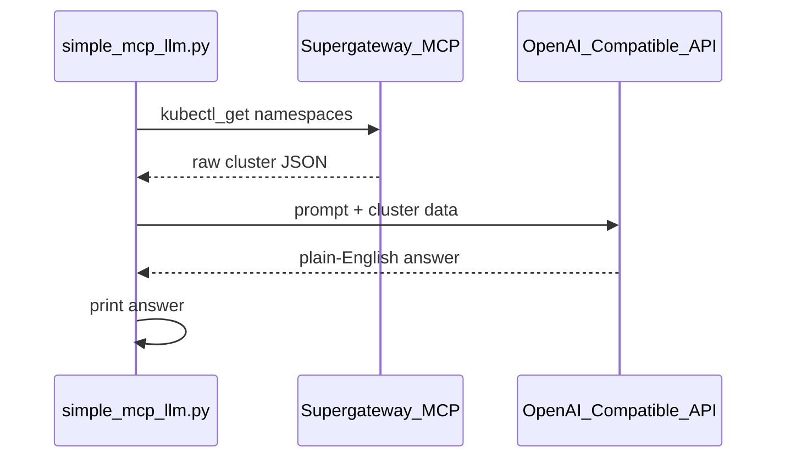

# Guide 0: Understand `simple_mcp_llm.py`

**Time Budget:** 4–5 mins

**Narrative:** Three steps, under 60 lines — build a prompt, call MCP to read the cluster, send the result to the LLM, print the answer.

**Prerequisites:** Section 05 Supergateway running; `.env` with OpenAI-compatible settings.

---

## The flow



Open the file:

```bash
cat sections/06-mcp-data-agent/simple_mcp_llm.py
```

---

### 1) Load configuration from `.env`

```python
load_dotenv(Path(__file__).parents[2] / ".env")
```

**What it does:** Reads `OPENAI_BASE_URL`, `OPENAI_API_KEY`, `OPENAI_MODEL_ID`, and related settings from the repo-root `.env` file.

> *Talking point: "We never hardcode API keys in the script. Same `.env` pattern we'll reuse in Section 07."*

---

### 2) The prompt

```python
PROMPT = "list all namespaces"
```

**What it does:** A fixed question — list every namespace in the cluster. No command-line args needed.

> *Talking point: "One prompt, one MCP call, one answer. Keep the first demo dead simple."*

---

### 3) Connect to MCP and call `kubectl_get`

```python
async with streamablehttp_client("http://localhost:8000/mcp") as (read, write, _):
    async with ClientSession(read, write) as session:
        await session.initialize()
        result = await session.call_tool(
            "kubectl_get",
            {"resourceType": "namespaces", "allNamespaces": True, "output": "name"},
        )
        data = tool_text(result)
```

**What it does:** Opens an MCP session to the Supergateway endpoint from Section 05, then calls `kubectl_get` for all namespaces.

**Why `async with streamablehttp_client`?** Section 05 exposes MCP as **Streamable HTTP** at `http://localhost:8000/mcp`. The official `mcp` Python SDK only supports that transport with async code. `streamablehttp_client` is the SDK's way to:
- open the HTTP connection to `/mcp`
- run the MCP `initialize` handshake (same as the curl in Section 05)
- hand back read/write streams for `ClientSession`
- close the connection when the `async with` block ends

`asyncio.run(main())` at the bottom is the one line that runs this async code from a normal script — students don't need to write async anywhere else.

> *Talking point: "This replaces the curl POST from Section 05. Same gateway, same tool — now in Python."*

---

### 4) LLM turns data into an answer

```python
answer = client.chat.completions.create(
    model=os.environ["OPENAI_MODEL_ID"],
    messages=[{"role": "user", "content": f"{prompt}\n\nCluster data:\n{data}\n\nAnswer in 2-3 sentences."}],
    ...
)
print(answer.choices[0].message.content)
```

**What it does:** Sends the prompt plus raw MCP JSON to the LLM. Prints one plain-English summary — that's the only output students see.

> *Talking point: "MCP gives facts; the LLM gives meaning. One MCP call, one LLM call — that's the whole loop."*

---

## Compare to `agent.py`

| | `simple_mcp_llm.py` | `agent.py` |
|---|---|---|
| **Scope** | List all namespaces | Every namespace, five resource types |
| **Output** | Plain-English answer | Full JSON snapshot |
| **LLM** | Yes (OpenAI-compatible) | No |
| **Use when** | Teaching prompt → MCP → answer | Collecting everything for downstream analysis |

> *Talking point: "`agent.py` is the bulk collector — see `1_guide.md`. `simple_mcp_llm.py` is where students first see prompt → MCP → answer."*

---

**Next:** Run it live and watch the LLM answer → `2_guide.md`
