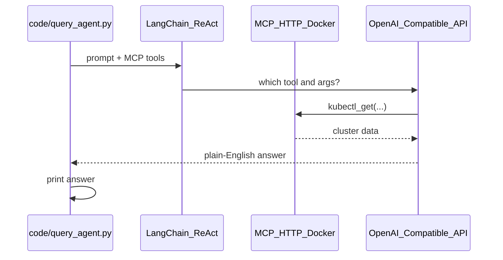

# Guide 1: Understand the Agent Code

**Time Budget:** 4–5 mins

**Narrative:** The Section 06 code lives in `code/` — load root config, connect to the persistent MCP HTTP endpoint, let LangChain pick tools, print the LLM's final answer.

**Prerequisites:** [`0_guide.md`](0_guide.md) — MCP container running; `validate_mcp.py` passed; virtualenv activated.

---

## The flow



Open the files:

```bash
cat sections/06-mcp-data-agent/code/mcp_client.py
cat sections/06-mcp-data-agent/code/query_agent.py
```

---

### 1) Shared MCP wiring — `code/mcp_client.py`

```python
load_dotenv(Path(__file__).parents[3] / ".env")
MCP_URL = os.getenv("K8S_MCP_URL", "http://localhost:8000/mcp")
tools, cleanup = await convert_mcp_to_langchain_tools(MCP_SERVERS)
```

**What it does:** Loads the repo-root `.env`, connects to Streamable HTTP at `/mcp` on the persistent Docker container, and converts MCP tools like `kubectl_get` into LangChain tools.

> *Talking point: "Both Section 06 scripts share this module — one place for the MCP endpoint."*

---

### 2) The prompt

```python
PROMPT = "list all namespaces"
```

**What it does:** A fixed demo question. Change it to anything — "how many pods in payment?", "show deployments in booking-api".

> *Talking point: "One prompt in. The LLM decides which MCP tool to call and with what arguments."*

---

### 3) LangChain ReAct agent picks the MCP tool

```python
llm = ChatOpenAI(model=..., base_url=..., api_key=...)
agent = create_agent(llm, tools)
result = await agent.ainvoke({"messages": [HumanMessage(content=PROMPT)]})
print(result["messages"][-1].content)
```

**What it does:** LangChain's agent loop handles tool choice — LLM chooses `kubectl_get`, MCP executes it, LLM writes the final answer.

**Why LangChain here?** Without it you'd hand-write: list tools, map schemas, parse tool calls, invoke MCP, call the LLM again. LangChain collapses that into ~10 lines.

> *Talking point: "Section 05 proved MCP with curl. Now the LLM drives the same tool calls over HTTP."*

---

## Compare to `snapshot_collector.py`

| | `code/query_agent.py` | `code/snapshot_collector.py` |
|---|---|---|
| **Scope** | One natural-language question | Broader cluster inventory request |
| **Output** | Plain-English answer | LLM-written inventory summary |
| **LLM** | Yes — picks MCP tools | Yes — picks MCP tools |
| **Use when** | Teaching prompt → MCP → answer | Showing a larger agent task with the same code path |

> *Talking point: "Same agent wiring, different prompt size. Section 07 is where we turn this kind of output into structured data."*

---

**Next:** Run the query agent live → `2_guide.md`, then run the inventory agent → `3_guide.md`
